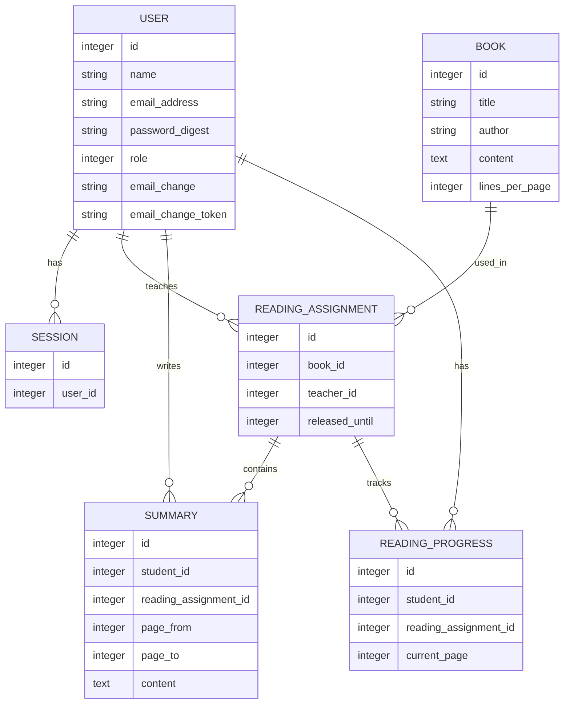
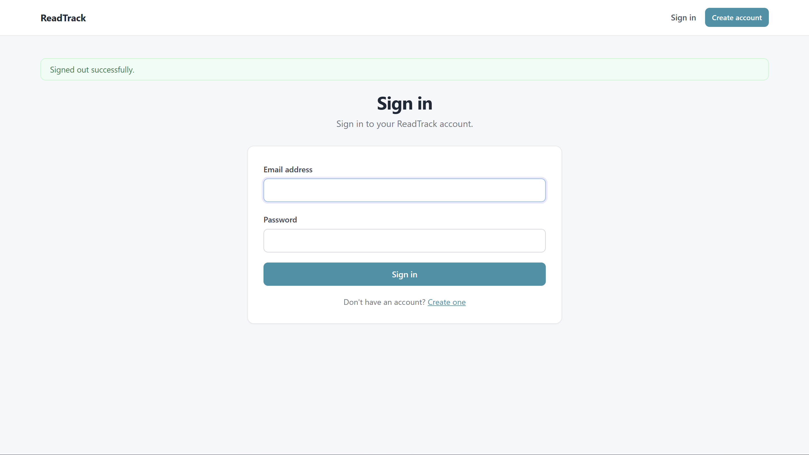
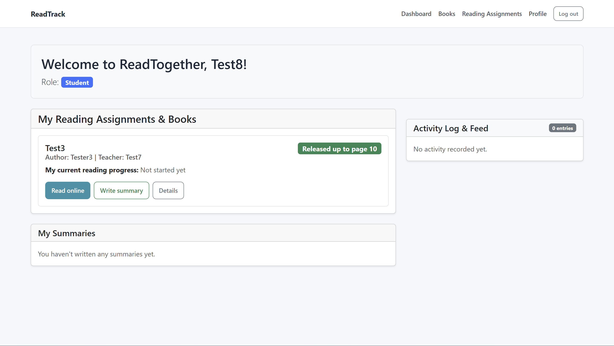

# ReadTrack – Projektdokumentation

## Titelblatt

| Angabe | Inhalt |
|---|---|
| **Modul** | ICT Modul 223 – Multiuser-Applikationen objektorientiert realisieren |
| **Projekt** | ReadTrack |
| **Datum** | 24.09.2026 |
| **Autor** | Andras Fodor |
| **Schulklasse** | 24-223-E |

---

## 1. Kurzüberblick

**ReadTrack** ist eine webbasierte Multiuser-Applikation für das gemeinsame Lesen im Schulalltag.

Lehrpersonen stellen Bücher bzw. Geschichten online bereit und erstellen daraus Leseaufträge. Sie können schrittweise festlegen, bis zu welcher Seite die Schülerinnen und Schüler lesen dürfen. Schülerinnen und Schüler lesen den freigegebenen Inhalt direkt in der Applikation, speichern ihren Lesefortschritt und verfassen Zusammenfassungen.

Die zentrale Fachregel lautet:

> Eine Zusammenfassung darf nur Seiten umfassen, die für den betreffenden Leseauftrag bereits freigegeben wurden.

---

# 2. Problemstellung

Beim gemeinsamen Lesen von Büchern und Geschichten in der Schule lesen Schülerinnen und Schüler nicht immer gleich schnell. Für die Lehrperson ist es deshalb schwierig, festzulegen, welche Inhalte bereits gelesen wurden und wer wie weit ist.
Ausserdem werden Zusammenfassungen häufig separat erstellt. Dadurch ist es für die Lehrperson schwieriger, den Überblick über den Lernfortschritt und die bearbeiteten Kapitel zu behalten.
ReadTogether soll das gemeinsame Lesen im Unterricht vereinfachen. Die Schülerinnen und Schüler können Bücher und Geschichten direkt online lesen. Die Lehrperson bestimmt, bis zu welchem Kapitel oder welcher Seite gelesen werden darf. Zu den freigegebenen Abschnitten können die Schülerinnen und Schüler direkt in der Anwendung eigene Zusammenfassungen schreiben.

---

# 3. Projekt

## 3.1 Domäne

**Bildung / Lesen**

## 3.2 Name

**ReadTrack**

## 3.3 Vision

ReadTrack wird entwickelt, um Lehrpersonen und Schüler/Schülerinnen, aber auch Privatpersonen beim gemeinsamen Lesen von Online-Büchern und Geschichten zu unterstützen. Die Lehrperson kann den Lesestoff schrittweise freigeben, während die Schülerinnen und Schüler die freigegebenen Inhalte online lesen und direkt dazu Zusammenfassungen erstellen.

## 3.4 MVP der ersten Iteration

Die wichtigste funktionale Anforderung für die erste Iteration ist das gemeinsame Lesen und freigegeben von Abschnitten.
Die Lehrperson kann einen Leseauftrag mit einem Buch oder einer Geschichte erstellen und festlegen, bis zu welchem Kapitel oder welcher Seite die Schülerinnen und Schüler lesen dürfen.
Die Schülerinnen und Schüler können den freigegebenen Text online lesen.

---

# 4. Anforderungsanalyse

## 4.1 Funktionale Anforderungen


| Priorität | ID | Funktionale Anforderung |
|---|---|---|
| **Must** | F1 | Benutzer können sich registrieren und einloggen. |
| **Must** | F2 | Lehrpersonen können einen Leseauftrag mit einem Online-Buch oder einer Geschichte erstellen. |
| **Must** | F3 | Lehrpersonen können festlegen, bis zu welchem Kapitel oder welcher Seite gelesen werden darf. |
| **Must** | F4 | Schülerinnen und Schüler können die freigegebenen Inhalte direkt online lesen. |
| **Must** | F5 | Schülerinnen und Schüler können zu freigegebenen Kapiteln oder Seiten Zusammenfassungen erstellen und speichern. |
| **Must** | F6 | Das System verhindert, dass Schülerinnen und Schüler Zusammenfassungen zu noch nicht freigegebenen Abschnitten erstellen. |
| **Must** | F7 | Lehrpersonen können die Zusammenfassungen der Schülerinnen und Schüler einsehen. |
| **Should** | F8 | Schülerinnen und Schüler können ihren eigenen Lesefortschritt speichern. |
| **Should** | F9 | Lehrpersonen können den Lesefortschritt ihrer Schülerinnen und Schüler einsehen. |
| **Should** | F11 | Änderungen an zentralen Records werden im Aktivitätsfeed angezeigt. |

## 4.2 Qualitätsattribute

1. |
Sicherheit: Schülerinnen und Schüler dürfen keine Funktionen der Lehrperson ausführen können.
2. |
Datenkonsistenz: Zusammenfassungen müssen eindeutig dem entsprechenden Schüler, Leseauftrag und Abschnitt zugeordnet werden.
3. |
Benutzerfreundlichkeit: Die Anwendung soll übersichtlich aufgebaut sein, sodass Schüler schnell erkennen können, was sie lesen und bearbeiten dürfen.
4. |
Verständliche Fehlerbehandlung: Wenn ein Schüler etwas bearbeiten möchte, was er nicht darf, erhält er eine verständliche Fehlermeldung.
---

# 5. Benutzerrollen und Berechtigungen

ReadTrack verwendet drei fachlich begründete Rollen.

| Funktion | Student | Teacher | Admin |
|---|---:|---:|---:|
| Anmelden / Abmelden | ✓ | ✓ | ✓ |
| Freigegebene Leseaufträge lesen | ✓ | ✓ | ✓ |
| Lesefortschritt speichern | ✓ | – | – |
| Eigene Zusammenfassungen erstellen | ✓ | – | – |
| Eigene Zusammenfassungen bearbeiten/löschen | ✓ | – | – |
| Zusammenfassungen des eigenen Leseauftrags ansehen | – | ✓ | ✓ |
| Buch erstellen/bearbeiten | – | ✓ | ✓ |
| Leseauftrag erstellen | – | ✓ | ✓ |
| Eigenen Leseauftrag bearbeiten | – | ✓ | ✓ |
| Fremden Leseauftrag bearbeiten | – | – | ✓ |
| Benutzerverwaltung | – | – | ✓ |


Verwendete Policies:

- `UserPolicy`
- `BookPolicy`
- `ReadingAssignmentPolicy`
- `SummaryPolicy`
- `ReadingProgressPolicy`

---

# 6. Kernfunktion

## 6.1 Fachlicher Ablauf

Die zentrale Funktion von ReadTogether ist das Lesen und Zusammenfassen eines von der Lehrperson freigegebenen Abschnitts.

```Beispiel:
Die Lehrperson gibt ein Buch bis Seite 30 frei.
Schüler können:
Seiten 1–30 lesen und dazu eine Zusammenfassung erstellen.
```

## 6.2 Fachliche Regel

Für eine Zusammenfassung gilt:

```text
page_to <= reading_assignment.released_until
```

Beispiel:

```text
Freigegeben bis Seite 10

Zusammenfassung Seite 1–10  → erlaubt
Zusammenfassung Seite 3–8   → erlaubt
Zusammenfassung Seite 1–11  → abgelehnt
```

Die Regel befindet sich im Modell `Summary` und wird deshalb serverseitig geprüft.

## 6.3 Fehlerfall

Versucht ein Schüler beispielsweise eine Zusammenfassung für die Seiten 1–11 zu speichern, obwohl nur bis Seite 10 freigegeben wurde, wird die Zusammenfassung nicht gespeichert.

Der Benutzer erhält eine verständliche Fehlermeldung:

> kann nicht über den freigegebenen Bereich (bis Seite 10) hinausgehen

Damit kann die Regel nicht einfach durch einen direkten HTTP-Request umgangen werden.

---

# 7. Datenmodell / ERM

Die wichtigsten Entitäten der Anwendung sind:



### Beziehungen

- Ein `User` kann mehrere `ReadingAssignment` als Lehrperson besitzen.
- Ein `Book` kann in mehreren `ReadingAssignment` verwendet werden.
- Ein `ReadingAssignment` gehört genau zu einem Buch und einer Lehrperson.
- Ein `ReadingAssignment` kann mehrere `Summary` und `ReadingProgress` enthalten.
- Eine `Summary` gehört zu genau einem Schüler und einem Leseauftrag.
- Ein Schüler besitzt pro Leseauftrag höchstens einen `ReadingProgress`.


---

# 8. Breadboards – User-Flows der ersten Iteration

## Flow A – Anmeldung

```text
[Login]
   │
   ├── gültige Zugangsdaten ──→ [Dashboard]
   │
   └── ungültige Daten ───────→ [Login + Fehlermeldung]
```

## Flow B – Lehrperson erstellt Buch

```text
[Dashboard]
   ↓
[Bücher]
   ↓
[Neues Buch]
   ↓
[Titel + Autor + Inhalt]
   ↓
[Speichern]
   ↓
[Buch anzeigen]
```

## Flow C – Lehrperson erstellt Leseauftrag

```text
[Dashboard / Leseaufträge]
   ↓
[Neuer Leseauftrag]
   ↓
[Buch auswählen]
   ↓
[Freigabe bis Seite X]
   ↓
[Speichern]
   ↓
[Leseauftrag]
```

## Flow D – Schüler liest

```text
[Dashboard]
   ↓
[Leseauftrag]
   ↓
[Online lesen]
   ↓
[Seite 1]
   ↓
[Seite 2] ... [freigegebene letzte Seite]
```

Navigation über die letzte freigegebene Seite hinaus ist nicht möglich.

## Flow E – Schüler erstellt Zusammenfassung

```text
[Leseauftrag]
   ↓
[Zusammenfassung schreiben]
   ↓
[Seitenbereich + Text]
   ↓
[Fachregel]
   ├── gültig → [Speichern]
   └── ungültig → [Fehlermeldung + Formular]
```

## Flow F – Lehrperson kontrolliert Klasse

```text
[Leseauftrag]
   ↓
[Klassenübersicht]
   ├── Lesefortschritte
   └── Zusammenfassungen
```

## Flow G – Administrator verwaltet Benutzer

```text
[Dashboard]
   ↓
[Benutzerverwaltung]
   ↓
[Benutzer auswählen]
   ↓
[Name / E-Mail / Rolle ändern]
   ↓
[Speichern]
```

---

# 9. Screens / Wireframes der ersten Iteration

Die aktuelle Anwendung verwendet Bootstrap für ein einheitliches, responsives Layout.

## Login



## Dashboard – Schüler



---

# 10. Locking und Transaktionen

## Warum?

ReadTrack ist eine Multiuser-Applikation. Mehrere Schülerinnen und Schüler können denselben Leseauftrag gleichzeitig verwenden, während eine Lehrperson den Freigabestand verändert.

Ein kritischer Fall ist:

```text
Lehrperson                  Schüler
     │                         │
     │ Freigabe ändern         │ Zusammenfassung speichern
     │                         │
     └────────── gleichzeitig ─┘
```

Die Prüfung darf nicht auf einem veralteten Freigabestand basieren.

## Umsetzung

Beim Ändern eines `ReadingAssignment` wird eine Transaktion verwendet und der Datensatz mit `lock!` gesperrt.

Beim Erstellen bzw. Aktualisieren einer `Summary` wird der zugehörige `ReadingAssignment` innerhalb einer Transaktion gesperrt, bevor die Zusammenfassung gespeichert wird.

Vereinfacht:

```ruby
ReadingAssignment.transaction do
  @reading_assignment.lock!

  # Freigabestand prüfen / ändern
  # ...
end
```

und:

```ruby
Summary.transaction do
  @reading_assignment.lock!

  # Summary validieren und speichern
  # ...
end
```

Damit wird die fachliche Prüfung mit einem konsistenten Stand des Leseauftrags verbunden.

---

# 11. Aktivitätsprotokoll

Für das Änderungsprotokoll wird **PaperTrail** verwendet.

Mit `has_paper_trail` werden Änderungen an zentralen Records aufgezeichnet:

- `Book`
- `ReadingAssignment`
- `Summary`
- `ReadingProgress`

Über `set_paper_trail_whodunnit` und `user_for_paper_trail` wird der aktuell angemeldete Benutzer als Verursacher gespeichert.

Der Feed zeigt beispielsweise:

```text
Anna (teacher):
Freigabebereich geändert: Seite 5 → Seite 10

Ben (student):
Zusammenfassung erstellt für Seiten 1–10

Ben (student):
Lesefortschritt aktualisiert auf Seite 8
```

Die Anzeige wird abhängig von der Rolle eingeschränkt:

- Admin sieht alle Aktivitäten.
- Lehrpersonen sehen Aktivitäten zu ihren Leseaufträgen.
- Schülerinnen und Schüler sehen ihre eigenen Zusammenfassungs- und Fortschrittsaktivitäten.

---

# 12. Erreichter Stand

Die zentrale erste MVP-Iteration ist umgesetzt.

### Umgesetzt

- Registrierung
- Anmeldung / Abmeldung
- Session-Verwaltung
- Passwort-Hashing und Passwortregeln
- Profilverwaltung
- Passwortänderung
- E-Mail-Änderung mit Bestätigungslink im Entwicklungsablauf
- Rollen `student`, `teacher`, `admin`
- Pundit-basierte Autorisierung
- Benutzerverwaltung für Admins
- Bücher / Geschichten
- Leseaufträge
- schrittweise Seitenfreigabe
- Online-Lesen
- Lesefortschritt
- Zusammenfassungen
- fachliche Prüfung des freigegebenen Bereichs
- Transaktionen und Locking an den relevanten Stellen
- Aktivitätsprotokoll mit PaperTrail
- rollenabhängiger Aktivitätsfeed
- Model-, Policy- und Controller-/Integrationstests

---

# 13. Begründete Abweichungen

## Seitenmodell statt Kapitelmodell

Im ursprünglichen Projektkonzept war die Freigabe teilweise als Kapitel- oder Seitenbereich gedacht. In der Umsetzung wurde ein **Seitenmodell** verwendet.

Der Buchtext wird anhand der konfigurierten Anzahl `lines_per_page` in Seiten aufgeteilt. Dadurch kann der Kernablauf mit der vorhandenen Textquelle umgesetzt werden, ohne eine zusätzliche Kapitelstruktur zu benötigen.

## Buchinhalt direkt in ReadTrack

Der Text wird direkt in `Book.content` gespeichert. Für das MVP ist dies einfacher und stellt sicher, dass die Freigabeprüfung unabhängig von externen Webseiten funktioniert. (Wir später noch villeicht angepasst)

## E-Mail-Versand

Für die E-Mail-Änderung muss im Projekt kein echter Mailversand eingerichtet werden. Gemäss Aufgabenstellung reicht es im Entwicklungsbetrieb, den Bestätigungslink zu protokollieren.

---

# 14. Offene Punkte

Folgende Punkte sind für eine spätere Erweiterung denkbar, sind aber nicht Bestandteil der notwendigen MVP-Kernfunktion:

- Klassen als eigenes Modell statt indirekter Zuordnung über Leseaufträge
- Kapitelmodell mit echten Kapitelgrenzen
- echter E-Mail-Versand für die E-Mail-Bestätigung
- detailliertere Auswertungen zum Lesefortschritt
- automatische Benachrichtigungen bei neuen Freigaben
- feinere Aktivitätsfilter und separate Activity-Seite
- produktionsreife Deployment-Konfiguration

Diese Punkte verändern die zentrale MVP-Funktion nicht.

---

# 15. Prüfung der Anforderungen

| Anforderung | Prüfung | Ergebnis |
|---|---|---|
| Anmeldung / Abmeldung | Session- und Controller-Tests | vorhanden |
| Geschützte Bereiche | Dashboard-/Controller-Tests | vorhanden |
| Rollen und Berechtigungen | Policy-Tests | vorhanden |
| Direkter Zugriff auf fremde Daten | Summary-/Assignment-Controller-Tests | vorhanden |
| Buchverwaltung | Book-Model- und Controller-Tests | vorhanden |
| Leseauftrag erstellen | Controller-Test | vorhanden |
| Freigabe ändern | Controller-Test inkl. Locking/Transaction | vorhanden |
| Nur freigegebene Seiten lesen | Read-Controller-Logik + Tests | vorhanden |
| Zusammenfassung innerhalb Freigabe | Model-/Controller-Test | vorhanden |
| Zusammenfassung ausserhalb Freigabe | Model-/Controller-Test | vorhanden |
| Eigene/fremde Zusammenfassungen | Policy-/Controller-Tests | vorhanden |
| Lesefortschritt | Model-/Policy-Tests | vorhanden |
| Aktivitätsprotokoll | PaperTrail-Versionen werden geprüft | vorhanden |
| Fehlermeldungen | Model-/Controller-Validierungen | vorhanden |


---

# 16. Technologie-Stack

| Technologie | Verwendung |
|---|---|
| Ruby | Programmiersprache |
| Ruby on Rails 8.1.3.1 | Webframework |
| SQLite3 | Datenbank |
| Bootstrap 5.3.3 | Benutzeroberfläche |
| Pundit 2.5.2 | Autorisierung |
| PaperTrail 17.0.0 | Änderungsprotokoll |
| bcrypt 3.1.22 | Passwort-Hashing |
| Rails Minitest | Automatisierte Tests |


---

# 17. Quellen

- Ruby on Rails Guides: https://guides.rubyonrails.org/
- Pundit: https://github.com/varvet/pundit
- PaperTrail: https://github.com/paper-trail-gem/paper_trail
- Bootstrap: https://getbootstrap.com/

